# Étape 1B — monservice (démo Spring Boot)

Service REST qui illustre le packaging en fat-jar et la conteneurisation Docker (mono-stage et multi-stage).

## Endpoints

- `GET /monservice/echo/{nom}` → `{"message":"echo: {nom}"}`
- `POST /monservice/hello` avec un body `{"nom":"valeur"}` → `{"message":"Hello valeur"}`

## Exécution locale (non conteneurisée)

Compilation du fat-jar avec Maven, puis lancement direct via `java -jar` :

```bash
mvn clean package
java -jar target/monservice.jar
```

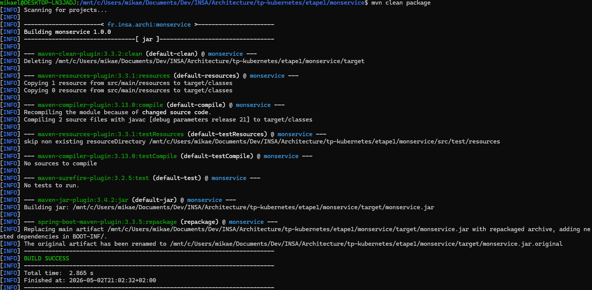
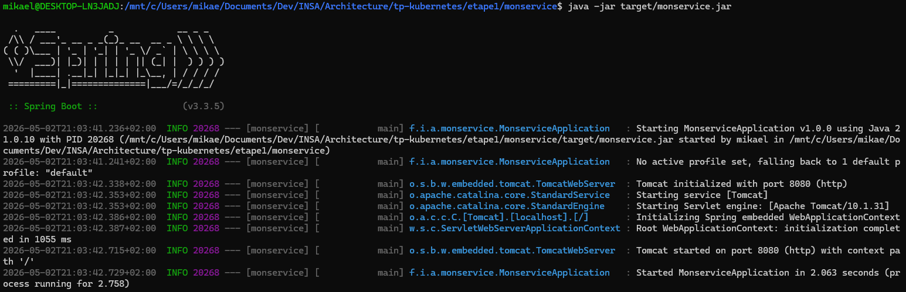

Dans un autre terminal, on teste les deux endpoints :

```bash
curl -i http://localhost:8080/monservice/echo/Mikael
curl -i -X POST -H 'Content-Type: application/json' \
  -d '{"nom":"Mikael"}' http://localhost:8080/monservice/hello
```

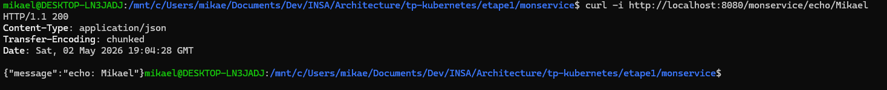
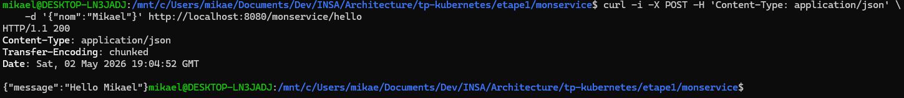

## Cas 1 — Dockerfile mono-stage + docker-compose

Le fat-jar doit avoir été produit au préalable dans `target/` (cf. `mvn clean package` ci-dessus). Le `Dockerfile.simple` ne fait que copier ce jar dans une image JRE allégée :

```dockerfile
FROM eclipse-temurin:21-jre
WORKDIR /app
COPY target/monservice.jar app.jar
EXPOSE 8080
ENTRYPOINT ["java","-jar","/app/app.jar"]
```

Le `docker-compose.yml` orchestre le build et le mappage de port :

```yaml
services:
  monservice:
    build: { context: ., dockerfile: Dockerfile.simple }
    image: monservice:simple
    ports: ["8080:8080"]
```

Build + démarrage en une commande :

```bash
docker compose up --build -d
docker compose ps
```

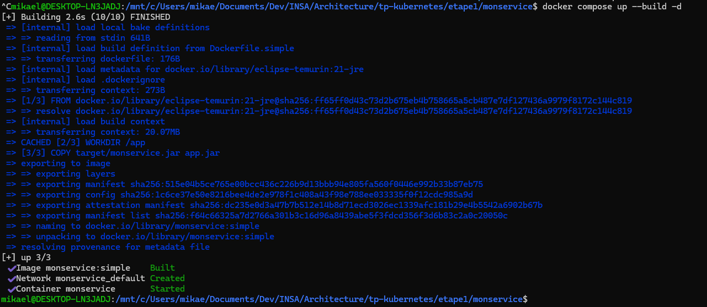
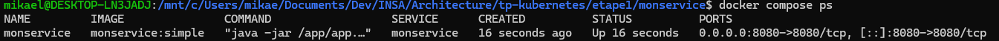

Test du service **via le conteneur** (preuve d'accès au container en cours d'exécution) :

```bash
curl -i http://localhost:8080/monservice/echo/Mikael
curl -i -X POST -H 'Content-Type: application/json' \
  -d '{"nom":"Mikael"}' http://localhost:8080/monservice/hello
```

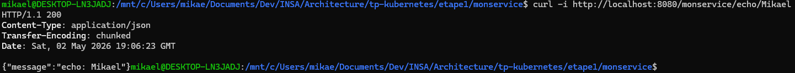

Arrêt :

```bash
docker compose down
```

## Cas 2 — Dockerfile multi-stage

Aucun JDK ni Maven requis sur la machine hôte. Les sources sont compilées à l'intérieur de la phase de build ; seule l'archive fat-jar produite est copiée dans l'image finale (JRE seul) :

```dockerfile
FROM maven:3.9-eclipse-temurin-21 AS build
WORKDIR /src
COPY pom.xml .
RUN mvn -B -q dependency:go-offline
COPY src ./src
RUN mvn -B -q -DskipTests package

FROM eclipse-temurin:21-jre
WORKDIR /app
COPY --from=build /src/target/monservice.jar app.jar
EXPOSE 8080
ENTRYPOINT ["java","-jar","/app/app.jar"]
```

Build en une seule commande, sans `mvn` préalable :

```bash
rm -rf target/   # le multi-stage compile depuis zéro
docker build -t monservice:multistage -f Dockerfile .
```

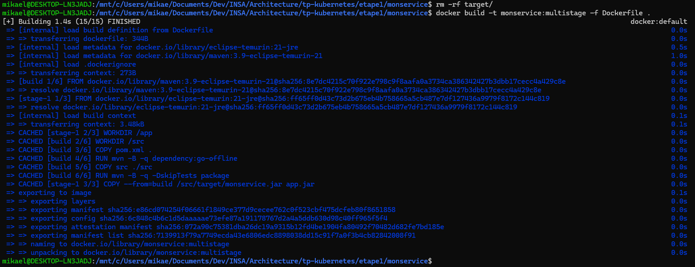

Lancement et test :

```bash
docker run -d --rm -p 8080:8080 --name monservice monservice:multistage
docker ps --filter name=monservice
curl -i http://localhost:8080/monservice/echo/Linkerd
curl -i -X POST -H 'Content-Type: application/json' \
  -d '{"nom":"Linkerd"}' http://localhost:8080/monservice/hello
```

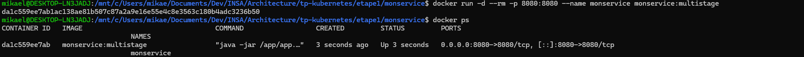
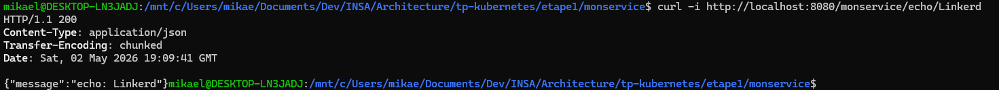

## Quel est l'intérêt de la technique multi-stage ?

```bash
docker images | grep monservice
```

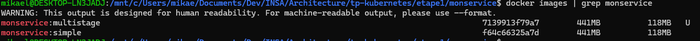

> **Note sur la taille des images** : les deux images finales (`monservice:simple` du Cas 1 et `monservice:multistage` du Cas 2) ont la **même taille** car elles partagent toutes les deux la même base `eclipse-temurin:21-jre` et y copient le même fat-jar. Le bénéfice de taille du multi-stage apparaît seulement face à une approche naïve qui laisserait Maven et le JDK dans l'image finale (image alors ~700 Mo au lieu de ~330 Mo). L'intérêt réel ici est ailleurs :

- **Aucune dépendance hôte** : quiconque clone le dépôt n'a besoin que de Docker. Plus besoin d'installer Java ni Maven sur la machine de build (CI, poste neuf, machine d'un collègue…). Le Cas 1, lui, exige `mvn package` avant `docker compose up`.
- **Build reproductible et versionné** : la version de Maven (`3.9`) et du JDK (`21`) sont figées dans le `Dockerfile`. Tout le monde produit le même binaire, indépendamment de ce qui est installé localement.
- **Une seule commande** des sources à l'image OCI : `docker build -f Dockerfile .` enchaîne `dependency:go-offline`, `package` et la production d'image, sans étape manuelle préalable.
- **Build context propre** : on isole l'outillage de compilation dans une couche jetable. Les artefacts intermédiaires (cache `.m2`, dossiers `target/` partiels…) ne polluent jamais l'image livrée.
- **Garantie de cohérence prod ↔ CI ↔ local** : le Cas 1 peut accidentellement embarquer un fat-jar produit avec un Java différent (ex. JDK 17 sur le poste, mais image JRE 21) ; le multi-stage rend cet écart impossible.
