# Réponses aux 20 questions Kubernetes / Minikube

## Gestion de Minikube

### (1) Vérifier que Minikube pointe correctement vers le moteur Docker

```bash
minikube profile list
minikube config get driver
docker info --format '{{.Name}} / {{.ServerVersion}}'
```

`Driver` doit valoir `docker`. La commande `minikube docker-env` documente comment réutiliser le daemon Docker interne du nœud Minikube.

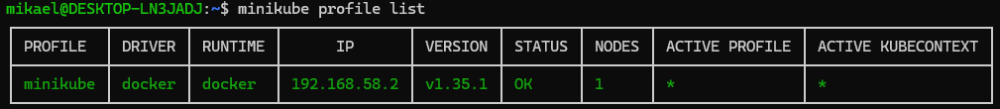

### (2) Quels sont les addons actuellement installés ?

```bash
minikube addons list
```

Liste sous forme de tableau avec colonne `STATUS` (enabled / disabled).

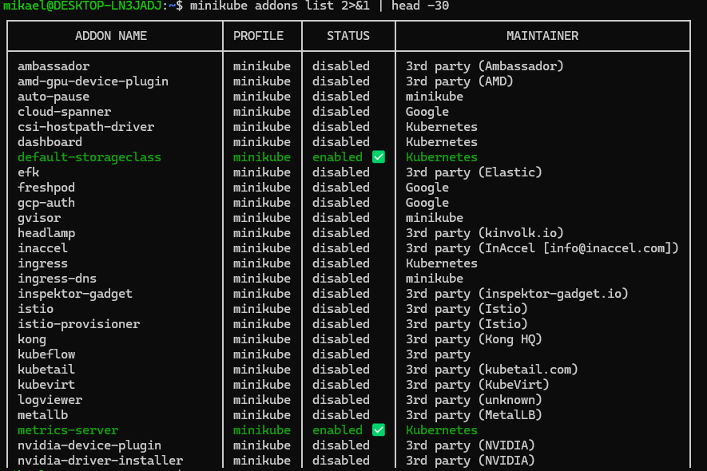

### (3) Installer un addon intéressant et justifier

On active `metrics-server` :

```bash
minikube addons enable metrics-server
kubectl top nodes
kubectl top pods -A
```

**Justification** : `metrics-server` est l'agrégateur de métriques de ressources de référence dans Kubernetes. Il alimente `kubectl top`, le `HorizontalPodAutoscaler`, et fournit une vue rapide CPU/mémoire complémentaire à ce que Linkerd Viz observera plus tard sur les requêtes HTTP. Empreinte minime, valeur immédiate pour le diagnostic.

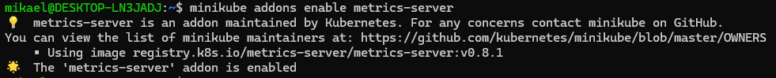
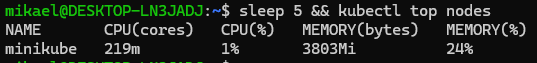
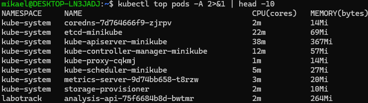


### (4) Lister les profils actifs avec leurs caractéristiques

```bash
minikube profile list
```

Colonnes : `Profile`, `VM Driver`, `Runtime`, `IP`, `Port`, `Version`, `Status`, `Nodes`.

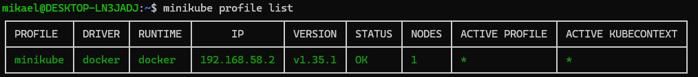

### (5) Quels sont les profils en cours ?

```bash
minikube profile
```

Affiche le profil actif (par défaut `minikube`).

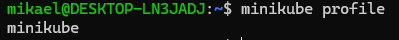

### (6) Créer un nouveau profil — qu'est-ce qu'un profil ?

```bash
minikube start -p demo --driver=docker --cpus=2 --memory=2g
minikube profile list
```

Un **profil** Minikube est une instance de cluster Kubernetes isolée : sa propre VM/conteneur, son propre kubeconfig context, ses propres addons, son propre stockage. On les utilise pour faire coexister plusieurs « clusters jouets » sur un même hôte (ex : un profil `dev`, un profil `mesh`, un profil `multi-node`). Le profil actif s'utilise via `minikube -p <nom> ...` ou `minikube profile <nom>`.

```bash
# Nettoyage
minikube delete -p demo
```

### (7) Afficher le statut de Minikube

```bash
minikube status
```

Sortie attendue : `host: Running`, `kubelet: Running`, `apiserver: Running`, `kubeconfig: Configured`.

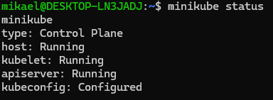

### (8) Comment accéder au dashboard de Minikube ?

```bash
minikube dashboard --url
# ou :
minikube dashboard
```

`--url` imprime l'URL sans ouvrir de navigateur (pratique en WSL où aucun browser n'est attaché).

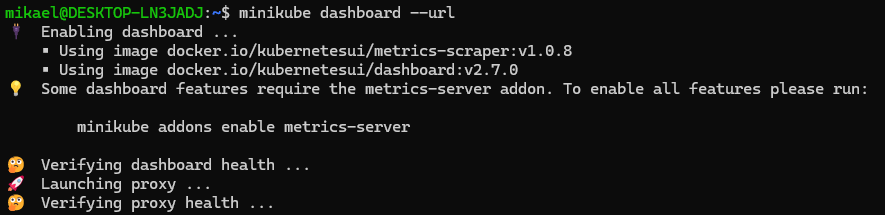

### (9) Qu'est-ce que le Dashboard, que présente-t-il ?

C'est l'**UI web officielle de Kubernetes**. Il agrège dans une seule interface :

- la vue d'ensemble du cluster (nœuds, espaces de noms, événements) ;
- les workloads (Deployments, ReplicaSets, Pods, StatefulSets, DaemonSets, Jobs, CronJobs) ;
- les services et la configuration réseau (Services, Ingresses) ;
- la configuration et le stockage (ConfigMaps, Secrets, PersistentVolumes / PersistentVolumeClaims) ;
- les rôles et politiques RBAC ;
- les logs en direct des conteneurs et l'exécution de commandes (`exec`) dans un pod.

### (10) Lister les nœuds d'un profil

```bash
kubectl get nodes -o wide
```

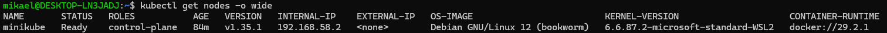
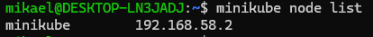


### (11) Ajouter un nœud à un profil et le supprimer

```bash
minikube node add
minikube node list
minikube node delete m02   # nom donné par défaut au second nœud
minikube node list
```

### (12) Consulter les logs de Minikube

```bash
minikube logs --file=mk.log     # vidange complète vers un fichier
minikube logs -n 200
```

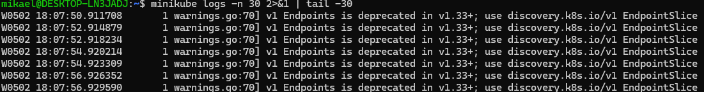

---

## Gestion des Pods et Services sous Kubernetes

### (13) Lister les images en cours d'exécution

```bash
minikube image ls
```

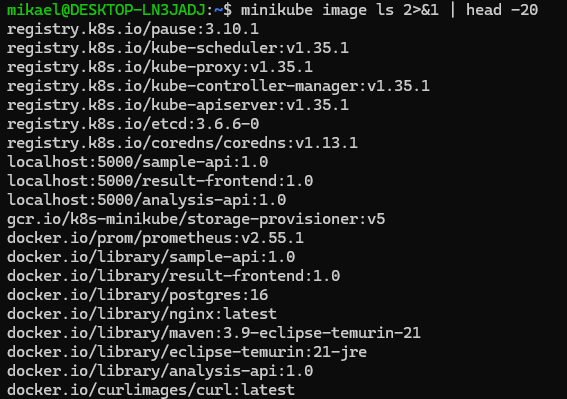

### (14) Lancer une image nginx en mode impératif

```bash
kubectl create deployment nginx --image=nginx
kubectl get deployment,pods -l app=nginx
```

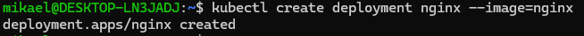
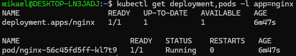


### (15) Créer un Service en mode impératif pour exposer nginx

```bash
kubectl expose deployment nginx --port=80 --type=NodePort
kubectl get svc nginx
```

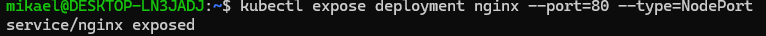
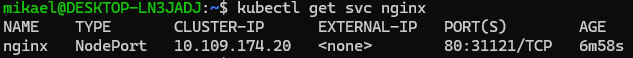
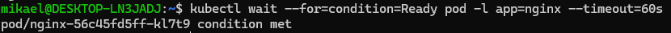

### (16) Visualiser les informations du Pod et du Service

```bash
NGINX_POD=$(kubectl get pods -l app=nginx -o jsonpath='{.items[0].metadata.name}')
kubectl describe pod "$NGINX_POD"
kubectl describe svc nginx
```

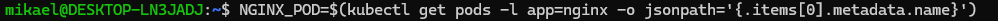
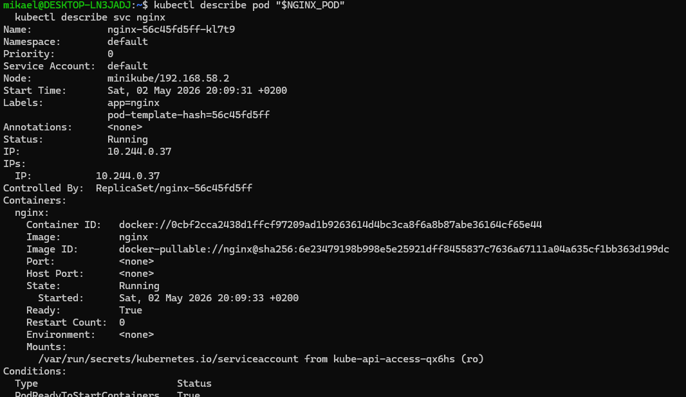
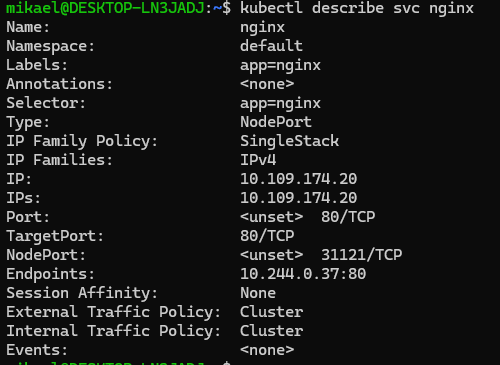


### (17) Obtenir l'URL du Service

```bash
minikube service nginx --url
```

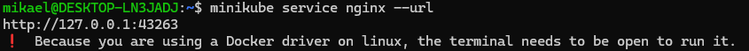

### (18) Exécuter le service dans un browser

```bash
URL=$(minikube service nginx --url)
echo "$URL"
curl -sI "$URL"
```

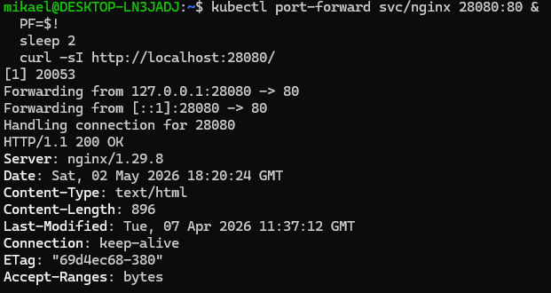

### (19) Lancer une commande bash dans le conteneur nginx

```bash
NGINX_POD=$(kubectl get pods -l app=nginx -o jsonpath='{.items[0].metadata.name}')
kubectl exec -it "$NGINX_POD" -- /bin/bash
```

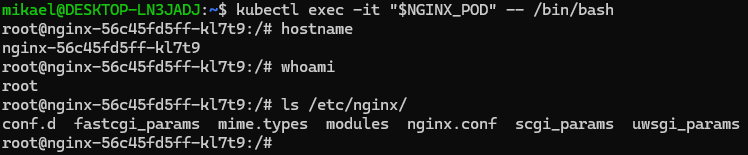

### (20) Lister les logs du conteneur nginx

```bash
kubectl logs "$NGINX_POD"
```

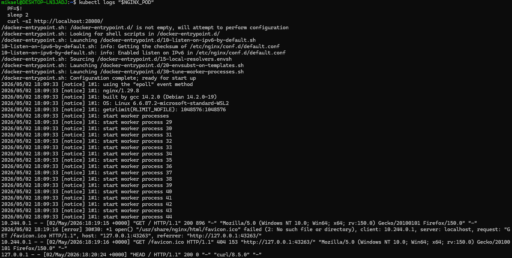

---

## Nettoyage

```bash
kubectl delete service nginx
kubectl delete deployment nginx
minikube stop
```
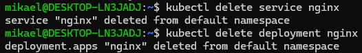

