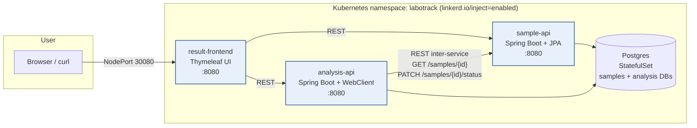

# LaboTrack — Architecture

## Goal

LaboTrack is a miniature Laboratory Information System (LIS) that simulates the lifecycle of a biological sample inside a clinical analysis lab — registration → analysis → validation → restitution — through 3 cooperating microservices deployed on Kubernetes (Minikube) under a Linkerd service mesh.

## Component diagram

Every meshed pod runs an injected `linkerd-proxy` sidecar (mTLS, viz, retries, authz). Postgres skips proxy injection (`config.linkerd.io/skip-*-ports: "5432"`) because the JDBC handshake confuses the L7 proxy on the wire we care about — JDBC traffic stays on the cluster CNI.

## Cycle de vie d'un échantillon

1. **Création** — l'utilisateur soumet le formulaire « Register » du frontend → `result-frontend` appelle `POST /samples` sur `sample-api` → un identifiant unique est attribué, statut `REGISTERED`.
2. **Analyse** — l'utilisateur clique « Analyze » → `result-frontend` appelle `POST /analyze/{id}` sur `analysis-api`.
3. **Inter-service** — `analysis-api` appelle `GET /samples/{id}` sur `sample-api` (preuve d'échange entre services), puis génère un résultat fictif (`glycémie ∈ [0.65 ; 1.30] g/L`) avec une interprétation biologique simulée (`low` / `normal` / `high`).
4. **Validation** — `analysis-api` persiste le résultat puis met à jour `sample-api` via `PATCH /samples/{id}/status` → statut `VALIDATED` (la « signature biologique »).
5. **Restitution** — l'utilisateur retourne sur la page d'accueil → `result-frontend` consomme à la fois `sample-api` (état) et `analysis-api` (résultat) pour afficher la ligne complète.

## Service Mesh — Linkerd

| Aspect | Mécanisme |
|---|---|
| **mTLS automatique** | tous les pods de `labotrack` ont un sidecar `linkerd-proxy` ; les communications inter-pods sont chiffrées et authentifiées par certificat injecté |
| **Observabilité** | `linkerd viz install` → dashboard, `stat`, `tap`, `top`, `edges` |
| **Retries / timeouts** | `ServiceProfile` (cf. `60-linkerd-serviceprofile.yaml`) marque les `GET` idempotents `isRetryable`, fixe un `timeout` par route, et limite les retries via `retryBudget` (20 % + 10 RPS minimum, TTL 10 s) |
| **Zero-Trust** | `Server` + `MeshTLSAuthentication` + `AuthorizationPolicy` (cf. `70-linkerd-authz.yaml`). `sample-api` n'accepte que `result-frontend` et `analysis-api` ; `analysis-api` n'accepte que `result-frontend` ; tout autre appelant reçoit `HTTP 403`. |

## Choix de communication — REST plutôt que gRPC

L'énoncé évoque gRPC dans la description introductive mais détaille des endpoints HTTP REST (`POST /samples`, `POST /analyze/{id}`, `GET /samples/{id}`). Linkerd traite REST et gRPC de manière équivalente pour `viz`, mTLS, retries et authz. REST est retenu parce que :

- Il colle aux signatures données par l'énoncé.
- Il accélère le développement (pas de protobuf, pas de codegen).
- Le frontend Thymeleaf consomme directement les API HTTP.
- La démonstration des `retries` Linkerd est plus parlante sur un `GET` HTTP que sur un appel gRPC.

## Déploiement — résumé

| Couche | Ressource | Réplicas |
|---|---|---|
| Données | `Postgres` StatefulSet + PVC + `Secret` | 1 |
| Réception | `Deployment` `sample-api` + `Service` ClusterIP | 2 |
| Traitement | `Deployment` `analysis-api` + `Service` ClusterIP | 3 (pour démontrer le load-balancing dans `viz top`) |
| Restitution | `Deployment` `result-frontend` + `Service` NodePort 30080 | 1 |

Toutes les images sont construites via **Dockerfile multi-stage** (Maven 3.9 + Temurin 21 dans la phase de build, JRE 21 seul dans l'image finale) et poussées vers le registry local de Minikube (`localhost:5000`, addon `registry` activé).
