# Rapport — TP Kubernetes / Service Mesh — LaboTrack

**Module Architecture — INSA — H. Tondeur 2026**

**Équipe** :
- Mikael LE CAM
- Antonin RIQUART
- Jonathan ISAMBOURG
- Gregoire LEGRAND

---

## 1. Contexte et environnement


| Outil | Version |
|---|---|
| Ubuntu | 24.04.4 LTS (Noble) |
| Docker Engine | 29.4.2 |
| Docker Compose | v5.1.3 |
| OpenJDK | 21.0.10 |
| Maven | 3.8.7 |
| kubectl | v1.36.0 |
| Minikube | v1.38.1 |
| Kubernetes (cluster) | v1.35.1 |
| Linkerd CLI | edge-26.5.1 |

Le fichier `bootstrap-wsl.sh` à la racine du dépôt automatise toute cette installation pour reproduire l'environnement.

---

## 2. Étape 1A — Manipulations Kubernetes (20 questions)

Réponses détaillées (commande + capture pour chaque question) dans `etape1/questions/answers.md`.

Captures dans `etape1/questions/screenshots/Q1.png` à `Q21.png`.

---

## 3. Étape 1B — Spring Boot demo (`monservice`)

Service REST minimal en Spring Boot 3.3.5 / Java 21, exposant :

- `GET /monservice/echo/{nom}` → `{"message":"echo: {nom}"}`
- `POST /monservice/hello` (body JSON `{"nom":"…"}`) → `{"message":"Hello {nom}"}`

Détails dans `etape1/monservice/README.md` ; captures pas-à-pas dans `etape1/monservice/screenshots/c1.png` à `c11.png`.

### 3.1 Cas 1 — Dockerfile mono-stage + docker-compose

**Pré-requis** : la fat-jar doit avoir été produite localement (`mvn clean package`).

```dockerfile
FROM eclipse-temurin:21-jre
WORKDIR /app
COPY target/monservice.jar app.jar
EXPOSE 8080
ENTRYPOINT ["java","-jar","/app/app.jar"]
```

```yaml
services:
  monservice:
    build: { context: ., dockerfile: Dockerfile.simple }
    image: monservice:simple
    ports: ["8080:8080"]
```

Test en local (preuve de bon fonctionnement non conteneurisé) puis depuis le conteneur (preuve d'accès au container en cours d'exécution) — détails et captures dans `etape1/monservice/README.md`.

### 3.2 Cas 2 — Dockerfile multi-stage

```dockerfile
FROM maven:3.9-eclipse-temurin-21 AS build
WORKDIR /src
COPY pom.xml .
RUN mvn -B -q dependency:go-offline
COPY src ./src
RUN mvn -B -q -DskipTests package

FROM eclipse-temurin:21-jre
WORKDIR /app
COPY --from=build /src/target/monservice.jar app.jar
EXPOSE 8080
ENTRYPOINT ["java","-jar","/app/app.jar"]
```

Build, run et tests en une passe, sans `mvn` préalable côté hôte. Captures `c8.png` à `c10.png`.

### 3.3 Quel est l'intérêt de la technique multi-stage ?

| Critère | Mono-stage (cas 1) | Multi-stage (cas 2) |
|---|---|---|
| Taille image finale | JRE + jar (~330 Mo) | JRE + jar (~330 Mo, identique car même base) |
| Outils dans l'image | JRE + fat-jar | JRE + fat-jar |
| Dépendance hôte | JDK + Maven obligatoires (`mvn package` avant `docker compose up`) | aucune (Docker suffit) |
| Étapes côté CI | `mvn package` + `docker build` | `docker build` (une seule commande) |
| Reproductibilité | dépend de la version Java/Maven hôte | versions épinglées dans la phase de build |
| Cohérence prod ↔ CI ↔ local | risque (fat-jar produit sous JDK différent) | garantie (build dans l'image) |

> **Note** : ici, le bénéfice de **taille** est nul car les deux Dockerfiles utilisent la même base `eclipse-temurin:21-jre`. Le gain de taille apparaît seulement face à une image naïve qui laisserait Maven et le JDK dans la couche finale (~700 Mo). Le vrai bénéfice du multi-stage dans notre cas est l'**indépendance de l'hôte** et la **reproductibilité**.

---

## 4. Étape 2 — LaboTrack

### 4.1 Architecture

3 microservices (`sample-api`, `analysis-api`, `result-frontend`) + une base PostgreSQL partagée (deux schémas), tous déployés dans le namespace `labotrack` annoté `linkerd.io/inject=enabled` pour bénéficier automatiquement du sidecar Linkerd.

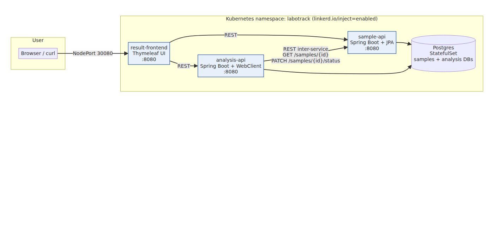

Description détaillée et diagramme source mermaid : `architecture.md`.

### 4.2 Cycle de vie type d'un échantillon

1. **Création** — `result-frontend` appelle `POST /samples` sur `sample-api` (statut `REGISTERED`).
2. **Analyse** — `result-frontend` appelle `POST /analyze/{id}` sur `analysis-api`.
3. **Inter-service** — `analysis-api` appelle `GET /samples/{id}` sur `sample-api`, génère un résultat aléatoire (`glycémie ∈ [0.65 ; 1.30] g/L`), persiste, puis met à jour le statut à `VALIDATED` via `PATCH /samples/{id}/status`.
4. **Restitution** — `result-frontend` interroge à la fois `sample-api` et `analysis-api` pour afficher le tableau agrégé.

### 4.3 Multi-stage Dockerfiles

Les trois services partagent un Dockerfile multi-stage identique au Cas 2 ci-dessus (cf. § 3.2). Une seule commande `docker build` produit l'image OCI prête au déploiement, sans dépendance hôte.

### 4.4 Build & push images vers la registry

Les 3 images sont buildées puis poussées dans la registry interne de Minikube.

#### 4.4.1 Activation de la registry Minikube

```bash
minikube addons enable registry
```

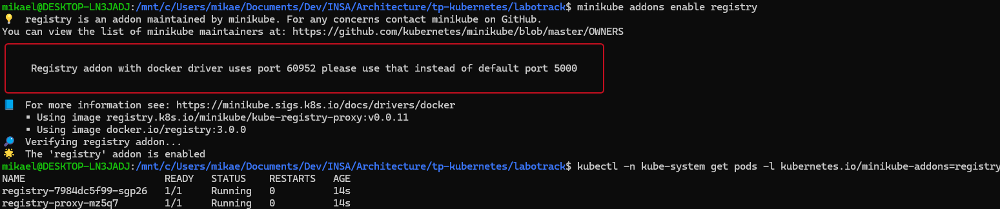

Le pod `registry` tourne dans `kube-system`. On l'expose sur `localhost:5000` côté hôte via un `kubectl port-forward` :

```bash
kubectl -n kube-system port-forward --address 127.0.0.1 svc/registry 5000:80 &
curl -s http://localhost:5000/v2/_catalog   # -> {"repositories":[]}
```

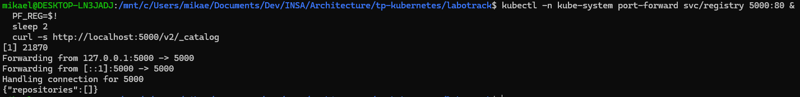

#### 4.4.2 Build des images sur le docker hôte

On bascule explicitement sur le docker WSL (et non celui de minikube) :

```bash
eval $(minikube docker-env -u)
docker info --format 'Server = {{.ServerVersion}}'
```

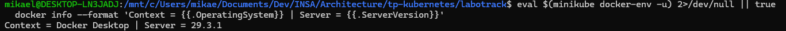

Build de `sample-api` (multi-stage, une seule passe) :

```bash
docker build -t localhost:5000/sample-api:1.0 labotrack/services/sample-api
```

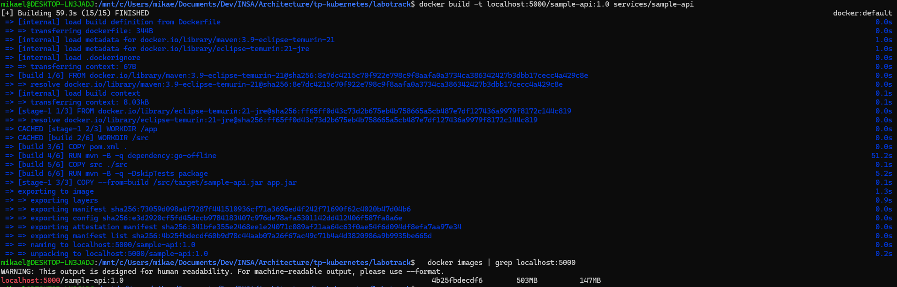

Configuration du daemon Docker pour reconnaître la registry HTTP :

```bash
sudo tee /etc/docker/daemon.json >/dev/null <<'EOF'
{ "insecure-registries": ["localhost:5000", "127.0.0.1:5000"] }
EOF
sudo systemctl restart docker
docker info | grep -A3 'Insecure Registries'
```

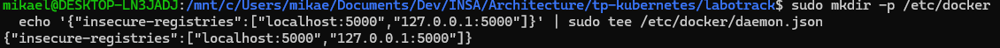

> **Note technique** : malgré la configuration `insecure-registries`, le daemon Docker dans cet environnement WSL2 a continué à tenter HTTPS avec `i/o timeout`. On bascule sur `skopeo` qui accepte `--dest-tls-verify=false` par invocation et bypasse complètement la config du daemon. Le résultat dans la registry est strictement identique : même format OCI, mêmes blobs, même catalogue.

#### 4.4.3 Push avec `skopeo`

```bash
sudo apt-get install -y skopeo
skopeo copy --dest-tls-verify=false \
  docker-daemon:localhost:5000/sample-api:1.0 \
  docker://127.0.0.1:5000/sample-api:1.0
```

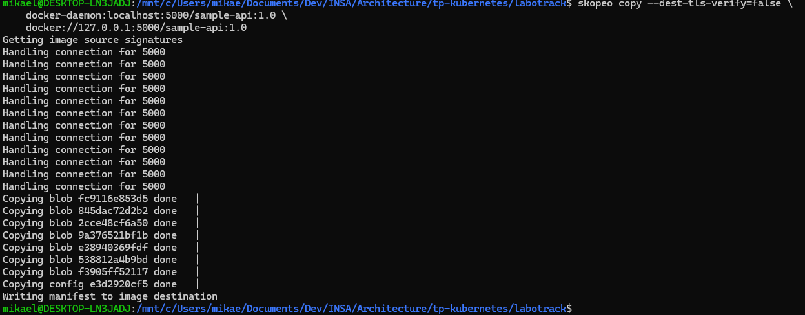

Vérification immédiate côté registry :

```bash
curl -s http://127.0.0.1:5000/v2/_catalog
# -> {"repositories":["sample-api"]}
```

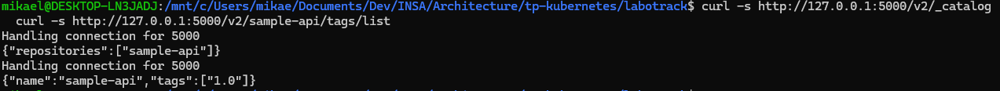

Push des deux autres services (les images ont été exportées depuis le docker de Minikube via `docker save` puis chargées côté hôte avec `docker load` avant `skopeo copy`) :

```bash
for svc in analysis-api result-frontend; do
  skopeo copy --dest-tls-verify=false \
    docker-daemon:localhost:5000/$svc:1.0 \
    docker://127.0.0.1:5000/$svc:1.0
done

curl -s http://127.0.0.1:5000/v2/_catalog
# -> {"repositories":["analysis-api","result-frontend","sample-api"]}
```

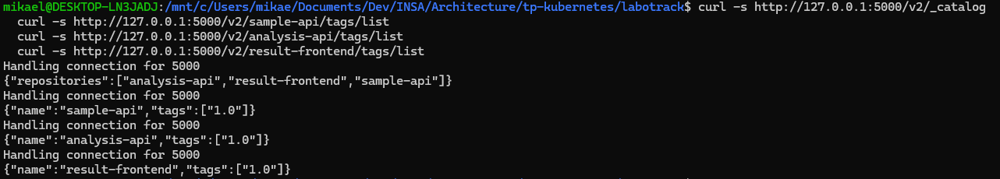

#### 4.4.4 Preuve que le cluster pull bien depuis la registry

Pour démontrer formellement que les pods récupèrent l'image depuis la registry (et non depuis un cache local), on bascule `sample-api` en `imagePullPolicy: Always`, on supprime l'image cachée dans Minikube, puis on relance le rollout :

```bash
kubectl -n labotrack patch deploy/sample-api --type=json \
  -p='[{"op":"add","path":"/spec/template/spec/containers/0/imagePullPolicy","value":"Always"}]'
minikube ssh -- "docker rmi localhost:5000/sample-api:1.0"
kubectl -n labotrack rollout restart deploy/sample-api
kubectl -n labotrack rollout status  deploy/sample-api --timeout=180s
kubectl -n labotrack describe pod -l app=sample-api | sed -n '/Events:/,$p'
```

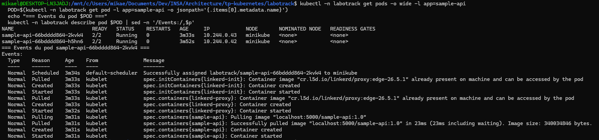

L'événement clef dans la sortie est :

```
Normal  Pulling   ...  Pulling image "localhost:5000/sample-api:1.0"
Normal  Pulled    ...  Successfully pulled image "localhost:5000/sample-api:1.0" in 23ms ... Image size: 340034846 bytes.
```

→ Le kubelet a explicitement contacté la registry et téléchargé l'image (340 Mo). Les images Linkerd (`linkerd-init`, `linkerd-proxy`) sont quant à elles « already present on machine » car elles ont été cachées lors de l'installation initiale du mesh.

### 4.5 Manifests Kubernetes

| Fichier | Rôle |
|---|---|
| `00-namespace.yaml` | Namespace `labotrack` annoté `linkerd.io/inject=enabled` |
| `10-postgres.yaml` | StatefulSet Postgres + Service headless + Secret + ConfigMap d'init |
| `20-sample-api.yaml` | Deployment 2 replicas + Service ClusterIP, profil Spring `prod` |
| `30-analysis-api.yaml` | Deployment 3 replicas + Service ClusterIP, latence simulée 300 ms |
| `40-result-frontend.yaml` | Deployment 1 replica + Service `NodePort 30080` |
| `60-linkerd-serviceprofile.yaml` | ServiceProfile (retries idempotents, timeouts) |
| `70-linkerd-authz.yaml` | Server + MeshTLSAuthentication + AuthorizationPolicy zero-trust |
| `99-rogue-pod.yaml` | Pod « pirate » optionnel pour démontrer le rejet par l'AuthorizationPolicy |

État du cluster après déploiement complet :

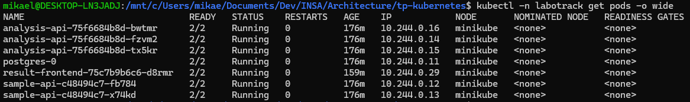

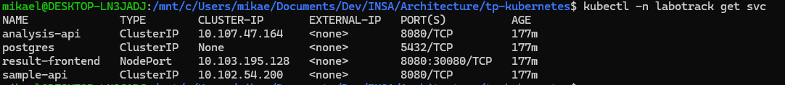

Preuve concrète de l'injection Linkerd dans un pod :

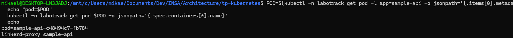

Chaque pod expose deux containers : le container applicatif **et** `linkerd-proxy`.

### 4.6 Service Mesh Linkerd

Installation :

```bash
kubectl apply --server-side -f \
  https://github.com/kubernetes-sigs/gateway-api/releases/download/v1.2.1/standard-install.yaml
linkerd install --crds | kubectl apply -f -
linkerd install --set proxyInit.runAsRoot=true | kubectl apply -f -
linkerd check
linkerd viz install | kubectl apply -f -
linkerd viz check
```

Vérifications de santé :

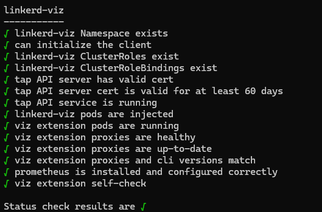

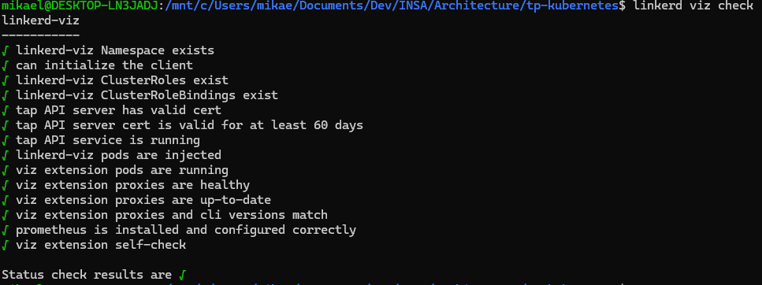

#### mTLS automatique (objectif énoncé)

```bash
linkerd -n labotrack viz edges deploy
```

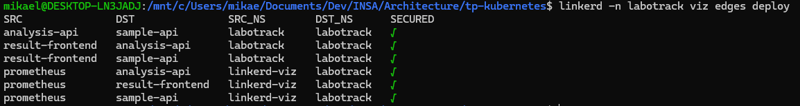

Toutes les communications inter-pods (`result-frontend → sample-api`, `result-frontend → analysis-api`, `analysis-api → sample-api`, et celles depuis Prometheus) sont **chiffrées et authentifiées par certificats** générés automatiquement par Linkerd. Aucune configuration applicative requise.

#### Monitoring (stat / tap / top — objectif énoncé)

```bash
linkerd -n labotrack viz stat deploy
```

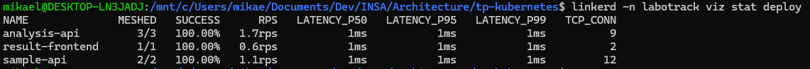

```bash
linkerd -n labotrack viz top deploy/analysis-api
```

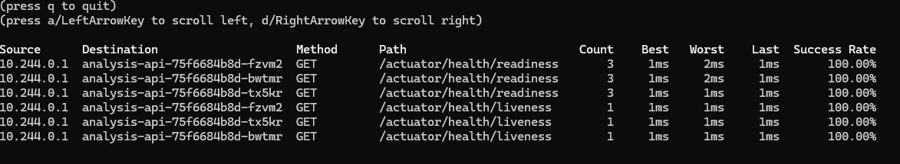

### 4.7 ServiceProfile — retries & timeouts

Pour `sample-api`, les `GET /samples` et `GET /samples/{id}` sont marqués `isRetryable: true` (idempotents) avec un timeout de 3 s. Les `POST /samples` ne sont pas retryables (effet de bord). Un `retryBudget` (20 % + 10 RPS minimum, TTL 10 s) borne le nombre de retries pour éviter les amplifications de panne.

Pour `analysis-api`, le `POST /analyze/{id}` a un timeout de 8 s (compatible avec la latence simulée de 300 ms), tandis que les `GET /results` sont retryables avec timeout de 3 s.

Les routes définies dans le `ServiceProfile` apparaissent dans `linkerd viz top` (ci-dessus) et dans le dashboard graphique (cf. § 4.10).

### 4.8 ServerAuthorization — zero-trust

Chaque service expose un objet `Server` Linkerd. Les autorisations sont :

| Backend | Callers autorisés |
|---|---|
| `sample-api` | `result-frontend` + `analysis-api` (identités MeshTLS) |
| `analysis-api` | `result-frontend` (identité MeshTLS) |
| `result-frontend` | tout le monde (NetworkAuthentication 0.0.0.0/0, exposé en NodePort) |

Tout autre appelant en intra-cluster (ex. un pod pirate dans un autre namespace) reçoit `HTTP 403`. Démonstration via `kubectl apply -f labotrack/manifests/99-rogue-pod.yaml` puis curl interne :

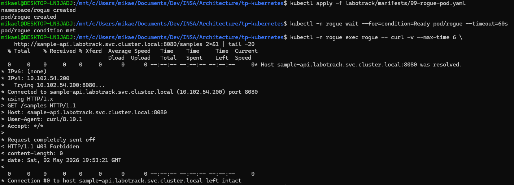

La trace verbose `curl -v` confirme la fermeture par le proxy Linkerd avant même que la requête atteigne l'application — c'est l'application stricte de la politique zero-trust.

### 4.9 RunBook

Le script idempotent `labotrack/runbook.sh` enchaîne en une commande :

1. `minikube start` (si nécessaire).
2. Installation Gateway API CRDs + Linkerd CRDs + control plane + Viz.
3. Build des 3 images en stratégie `registry` (par défaut) ou `in-cluster`.
4. `kubectl apply -f labotrack/manifests/`.
5. Attente des rollouts.
6. Affichage de l'URL du frontend.

### 4.10 Déroulement de la démo

#### Frontend — UI complète

État initial (registry vide) :

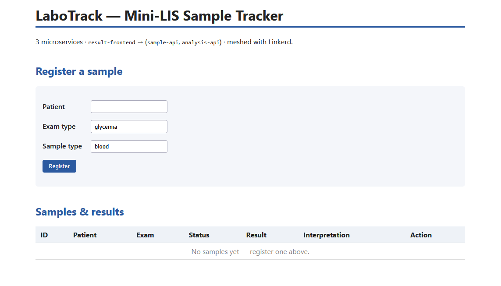

Après enregistrement de 4 patients et déclenchement de leurs analyses :

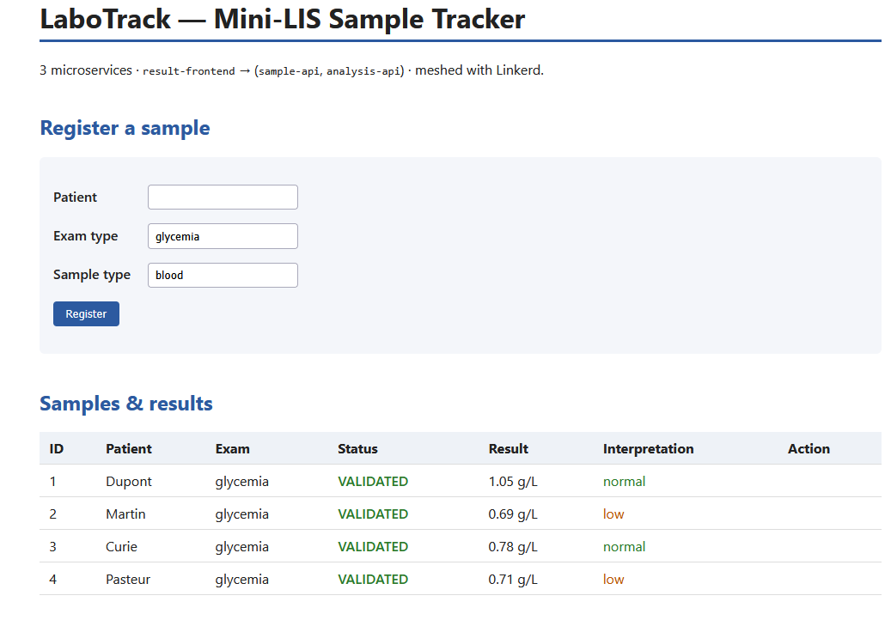

Chaque ligne montre la chaîne complète :

1. **Création** via `POST /samples` (statut `REGISTERED`).
2. **Analyse** via `POST /analyze/{id}` qui appelle en interne `sample-api` (preuve d'inter-service).
3. **Validation** : `analysis-api` met le statut à `VALIDATED` et la valeur de glycémie + son interprétation (`low / normal / high`) apparaissent dans le tableau.

Le smoke test automatique correspondant est sauvegardé dans `labotrack/docs/smoke-test.log`.

#### Linkerd Viz — UI graphique

Vue d'ensemble des namespaces :

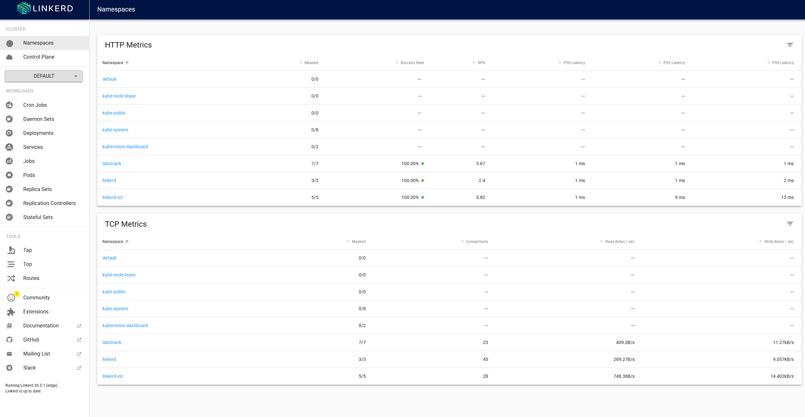

Topologie auto-découverte du namespace LaboTrack (les flèches sont les flux REST réels capturés par les sidecars) :

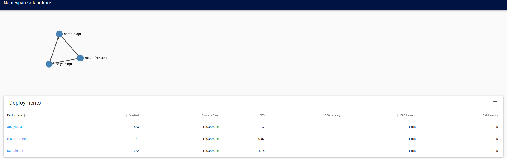

Métriques HTTP + TCP par déploiement (1-2 ms p99, 100 % de succès, 100 % maillé) :

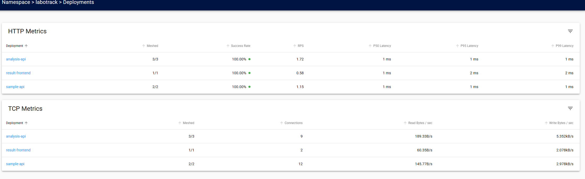

Vue détaillée d'un service (`sample-api`) avec ses pods et routes :

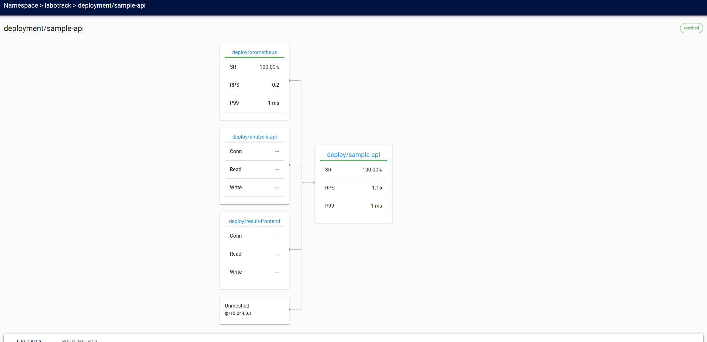

---

## 5. Limites et pistes d'amélioration

- **Postgres** en single-replica (acceptable pour la démo, pas pour la production — opérateur recommandé en prod).
- **Schéma JPA** géré par `ddl-auto=update` (Flyway/Liquibase recommandé en prod).
- **Pas d'Ingress** : le frontend est exposé en NodePort 30080. Une `Ingress + cert-manager` serait préférable hors Minikube.
- **Prometheus/Grafana standalone** non livré : Linkerd Viz embarque déjà les deux. La mise en place d'un kube-prometheus-stack indépendant est laissée comme amélioration.
- **Daemon Docker WSL2 + insecure-registries** : la directive `insecure-registries` n'a pas été honorée par notre instance de daemon Docker, contournée par `skopeo`. Investigation plus poussée à mener (peut-être un bug spécifique à la version du paquet `docker-ce` sur WSL2).

---

## 6. Annexes

- `architecture.md` — diagramme et choix de design.
- `manuel-technique.md` — détails de la stack et des manifests.
- `manuel-utilisateur.md` — guide de démarrage et dépannage.
- `runbook.sh` — script idempotent de déploiement.
- `bootstrap-wsl.sh` — script d'amorçage de l'environnement WSL2.
- `smoke-test.log` — trace texte du flow end-to-end.
- `zero-trust.log` — trace texte de la démo zero-trust.
